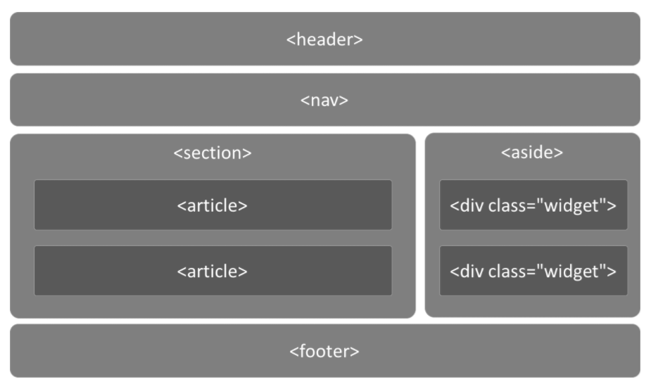
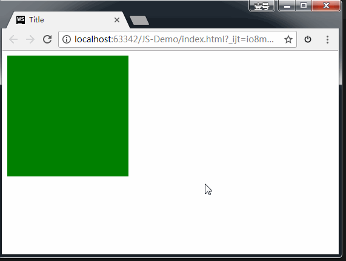
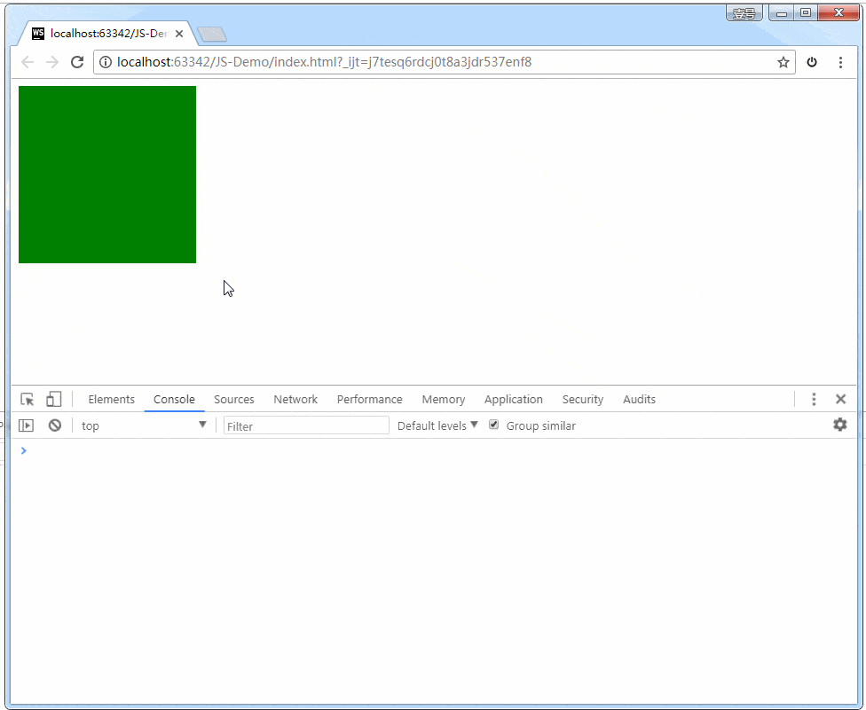

# HTML
<!-- 
[[toc]] -->
指的是超文本标记语言（Hyper Text Markup Language）是一种标记语言（markup language）。

**超文本的含义**它可以加入图片、声音、动画、多媒体等内容（超越文本限制）。

## 文档类型声明标签

这句话的意思是：当前页面采用的是 HTML5 版本来显示网页。注意：

```html
1. <!DOCTYPE> 声明位于文档最前面的位置，处于<html>标签之前。
2. <!DOCTYPE> 不是一个 HTML 标签，他就是文档类型声明标签。
```

这句话的意思是：当前页面采用的是 HTML5 版本来显示网页。注意：

### lang 语言种类

用来显示当前文档显示的语言。

```html
<html lang="zh-CN">
  <html lang="en"></html>
</html>
```

1. en 定义语言为英文。
2. zh-CN 定义语言为中文。

这个属性对浏览器和搜索引擎（谷歌/百度）还是有作用的。

### meta 标签

charset 字符集

```
<meta charset="UTF-8" />
```

用的值有：GBK、UTF-8，其中UTF-8被称为万国码，基本包含了全世界所有国家需要用到的字符。

## 页面描述

许多 `<meta>` 元素包含了 name 和 content 属性：

- name 指定了 meta 元素的类型；说明该元素包含了什么类型的信息。
- content 指定了实际的元数据内容
这两个 meta 元素对于定义你的页面的作者和提供页面的简要描述是很有用的

## 视口 viewport

```html
   <meta name="viewport" content="width=device-width, initial-scale=1.0">
```

width=device-width ：表示视口宽度等于屏幕宽度。
viewport 这个知识点，初学者还比较难理解，以后学 Web 移动端的时候会用到。

## HTML 中的注释和特殊字符号

1. 注释: <!--注释-->VSCode 中快捷键：Ctrk + /
2. 字符实体

| **字符** | **显示** |
| -------- | -------- |
| `&nbsp;`   | 空格     |
| `&lt;`     | ＜       |
| `&gt;`     | ＞       |
| `&copy;`  | ©        |

## 字体标签`<font>`

属性：

- color="红色"或color="#ff00cc"或color="new rgb(0,0,255)"：设置字体颜色。 设置方式：单词 \ #ff00cc \ rgb(0,0,255)
- size：设置字体大小。 取值范围只能是：1至7。取值时，如果取值大于7那就按照7来算，如果取值小于1那就按照1来算。如果想要更大的字体，那就只能通过css样式来解决。
- face="微软雅黑"：设置字体类型。

## HTML 常用标签

### 标题标签 h1-h6

```
<h1>标题标签</h1>
<h1>标题一共六级选,</h1>
<h2>文字加粗一行显。</h2>
<h3>由大到小依次减，</h3>
<h4>从重到轻随之变。</h4>
<h5>语法规范书写后，</h5>
<h6>具体效果刷新见。</h6>
```

### 段落 p 和换行标签 br

p 指paragraph，意为段落。把文字有条理的显示出来就需要将文字分段显示。

在 html 中，`<p>`标签用于定义段落，将整个网页分成若干个段落。

`<p>`我是一个段落标签`</p>`
标签语义: 把 HTML 文档分割为若干段落。
特点：

1. 文本在一个段落中会根据浏览器窗口的大小自动换行。
2. 段落和段落之间保有空隙。
`<br/>` 是 break 缩写，意为打断、换行。
标签语义： 强制换行
特点：
1. `<br/>` 是个单标签。
2. `<br/>` 标签只是简单地开始新的一行，跟段落不一样，段落之间会插入一些垂直的间距。

### 文本格式化标签 strong加粗  em斜体 删除线del 下划线ins  (废弃)

语义 标签

- 加粗 `<strong></strong>`

- 斜体 `<em></em>`

- 删除线 `<del></del>`

- 下划线 `<ins></ins>`

这些标签，是有着浓厚的样式的作用，干涉了css的作用，所以HTML抛弃了他们。  
类似的还有水平线标签：`<hr />` 换行标签：`<br />` 但是，网页中需要换行的时候，是因为另起了一个段落，所以要用p，而不要用`<br />`。  

### div 和 span 标签

 div 和 span是没有语义的，它们是一个盒子，用来装内容的。

`<div>这是头部</div>`
`<span>今日价格</span>`

div 是 division 的缩写，表示分割、分区。span 意思是跨度、跨距。
特点：

1. div 标签用来布局，但是现在一行只能放一个 div，大盒子。
2. span 标签用来布局，一行可以多个 span，小盒子。

## 图像标签和路径

图像标签
``  
单词 image 的缩写，意为图像。  
src 是标签的 必须属性，用于指定图像文件的路径和文件名。  
| **属性** | **属性值** | **说明** |
| --- | --- | --- |
| src | 图片路径 | 必须属性 |
| alt | 文本 | 替换文本，当图片不显示时显示文字 |
| title | 文本 | 提示文本。鼠标放到图像上显示文字 |
| width | 像素 | 图像宽度 |
| height | 像素 | 图像高度 |
| border | 像素 | 图像边框粗细 |

### 路径

相对路径： 以引用文件位置为参考基础，而建立出来的目录路径。是相对于 HTML 页面的位置。

| **分类** | **符号** | **说明** |
| --- | --- | --- |
| 同级路径 |  | 同一级 |
| 下一级路径 | / | 位于 HTML 文件上一级 |
| 上一级路径 | ../ | 位于 HTML 文件下一级 |  

### 绝对路径

 是指目录下的绝对位置，直接到达目标位置，通常是从盘符开始的路径或者完整的网络地址。
这里假设trade是根目录  
1、基准a.html访问当前目录下img文件夹中的图片
src = ./img/a.jpg 或者 src = img/a.jpg ，img默认是当前目录下的img文件夹，./代表目录log  
2、基准a.html访问上一级目录下img文件夹中的图片
src = ../img/b.jpg，../代表目录parameter  
3、基准a.html访问根目录下img文件夹中的图片
src = /img/c.jpg 或者 src = ../../img/c.jpg， / 代表根目录trade，../../代表基准的上级目录parameter 的 上级目录trade，即根目录

### 超链接标签

`<a href="跳转目标" target="目标窗口的弹出方式">文本或图像</a>`
| **属性** | **作用** |
| --- | --- |
| href | 指定链接地址 url，为必须属性。跳转地址 |
| target | 指定页面打开方式，_self为默认值，_blank为在新窗口中打开 |

**超链接分类**

1. 外部链接
2. 内部链接：网站内部页面之间的相互链接。
3. 空链接: #
4. 下载链接：地址链接的是文件.exe、压缩包.zip 等。
5. 网页元素链接：在网页中的各种网页元素。如文本、图像、表格、音频、视频等。
6. 锚点链接：点击链接，可以快速定位到页面中的某个位置。
  ○ 在链接文本的href属性中，设置属性为 #名字的形式
  ○ 找到目标位置标签，里面添加一个 id 属性 = 名字

## HTML 语义化标签

为了实现语义化标记，HTML 提供了明确这些区段的专用标签，例如：  


## 表格标签`<table>`

表格基本语法  

1. `<table></table>` 用于定义表格的标签。
2. `<tr></tr>` 标签用于定义表格中的行，必须嵌套在 `<table></table>`中。
3. `<td></td>` 用于定义表格中的单元格，必须嵌套在 `<tr></tr>` 中。
4. `<th>` 标签表示 HTML 表格的表头部分
5. 字母 td 指表格数据（table data），即单元格的内容。  

合并单元格  
合并单元格方式：  
● 跨行合并：rowspan="合并单元格个数"  
● 跨列合并：colspan="合并单元格个数"  

1. 确定跨行 or 跨列。
1. 找到目标单元格：跨行取最上面为目标单元格，跨列取最左边为目标单元格。`<td colspan="2"></td>`
1. 删除多余单元格。

## 列表标签 `<ul>、<ol>、<dl>`

无序列表  

```html
<ul>     
<li>列表项1</li>    
 <li>列表项2</li>     
<li>列表项3</li> 
</ul>
```

有序列表  

```html
<ol>     
<li>列表项1</li>    
 <li>列表项2</li>     
<li>列表项3</li> 
</ol>
```

自定义列表  

```html
<dl>     
<dt>名词1</dt>     
<dd>名词1解释1</dd>     
<dd>名词1解释2</dd> 
</dl>
```

## 表单标签`<form>`

**为什么需要表头**  
收集用户信息。和用户进行交互，收集用户资料。  
**表单域**  
表单域是一个包含表单元素的区域。  
使用 `<form>` 标签用于定义表单域form 标签会将它范围内的表单元素信息提交给服务器。  
**语法格式**  
`<form action="url地址" method="提交方式" name="表单域名称">`  各种表单元素控件`</form>`  
**常用属性：**

| **属性** | **属性值** | **作用** |
| --- | --- | --- |
| action | url 地址 | 指定接受并处理表单数据的服务器的 url 地址 |
| method | get/post | 设置表单数据的提交方式 |
| name | 名称 | 用于指定表单名称，区分同一个页面中的多个表单域 |

## 表单元素`<input>`

`<input type="属性值" />`  
● input 标签为单标签  
● type 属性设置不同属性值来指定不同控件类型  
| **属性值** | **描述** |
| --- | --- |
| button | 定义可点击按钮 |
| checkox | 复选框 |
| file | 定义输入字段和“浏览”按钮，供文件上传 |
| hidden | 定义隐藏的输入字段 |
| image | 定义图像形式的提交按钮 |
| password | 定义密码字段。字符被掩码。 |
| radio | 定义单选按钮 |
| reset | 定义重置按钮，清除表单所有数据。 |
| submit | 定义提交按钮。重置按钮会清除表单所有数据。 |
| text | 定义输入字段。用户可输入文本，默认宽度为 20 个字符。placeholder 占位字 |

input 的其他属性  

| **属性** | **属性值** | **描述** |  
| --- | --- | --- |
| name | 自定义 | 定义 input 元素名称 |
| value | 自定义 | 规定 input 元素的值 |
| checked | checked | 规定此 input 元素首次加载时应当被选中 |
| maxlength | 正整数 | 规定输入字段字符的最大长度 |

::: warning  注意

1. 对于 radio 单选框，必须使 input 的 name 具有相同的属性值，才能实现多选一。 同理，复选框也要有相同的name值。
2. 单选框和复选框可以设置 checked 属性，页面打开默认选择按钮。
3. 设置 type 的值为 submit，点击按钮后可以把表单域 form 里面的表单元素里面的值提交给后台。
:::

## `<label>` 标签

`<label>` 标签为 input 元素定义标注。  
`<label>`标签用于绑定一个表单源深路，当点击 label 标签内的文本时，浏览器自动将焦点转到或者选择对应的表单元素上，提升用户体验。
语法：
`<label for="sex">男</label> <input type="radio" name="sex" id="sex" />`
核心：`<lable>`标签的 for 属性与相关元素的 id 属性相同。

## `<select>`   下拉表单元素

select 标签设置多个选项让用户选择，节约页面空间。  

```html
<select>     
<option>选项1</option>     
<option>选项2</option>     
<option>选项3</option> 
</select>
```

::: warning 注意

1. select 中至少包含一对 option。
2. 在 option 中定义属性selected=selected，当前项即为默认选项
:::

## `<textarea>` 文本域表单元素

```html
<textarea rows="3" cols="20">     
文本内容 
</textarea>
```

## HTML5新增多媒体标签

### 视频 `<vedio>`

所有浏览器支持 mp4 格式。

- src=url 视频地址
- autoplay="autoplay"
- controls="controls" 显示控件
- width 设置宽度
- height 设置高度
- loop=loop 设置循环播放
- preload="auto/none" 是否预加载
- poster=url 封面图片
- muted=muted 静音播放

### 音频 `<audio>`

所有浏览器支持 mp3 格式。

- controls：显示控件
- autoplay：（谷歌禁用）
- loop=loop 设置循环播放

``` html
<audio controls>
  <source src="viper.mp3" type="audio/mp3">
  <source src="viper.ogg" type="audio/ogg">
  <p>你的浏览器不支持 HTML5 音频，可点击<a href="viper.mp3">此链接</a>收听。</p>
</audio>
```

### `<bgsound>`标签：播放背景音乐

**属性：**

- src="音乐文件的路径"
- loop="-1"：属性值代表播放次数，-1代表循环播放。

举例：

```html
 <body>
 <bgsound src="王菲 - 清风徐来.mp3"></bgsound>
 </body>

```

## SVG (矢量) 图形到网页中

SVG 是用于描述矢量图像的XML语言。它基本上是像 HTML 一样的标记，只是你有许多不同的元素来定义要显示在图像中的形状，以及要应用于这些形状的效果。  
作为一个简单的例子，以下代码创建一个圆和一个矩形：

```html
<svg version="1.1"
     baseProfile="full"
     width="300" height="200"
     xmlns="http://www.w3.org/2000/svg">
  <rect width="100%" height="100%" fill="black" />
  <circle cx="150" cy="100" r="90" fill="blue" />
</svg>
```

## 拖拽元素

页面中设置了 draggable="true" 属性的元素。

```html
<!DOCTYPE html>
<html lang="en">
  <head>
    <meta charset="UTF-8">
    <title>Title</title>
    <link rel="stylesheet" href="css/font-awesome.min.css">
    <style>
      .box1{
        width: 200px;
        height: 200px;
        background-color: green;

      }
    </style>
  </head>
  <body>
    <!--给 box1 增加拖拽的属性-->
    <div class="box1" draggable="true"></div>
  </body>
</html>
```



上图中，我们给 box1 增加了draggable="true" 属性之后，发现 box1 是可以拖拽的。  
但是拖拽之后要做什么事情呢？这就涉及到事件监听。  
拖拽元素的事件监听：（应用于拖拽元素）  
● ondragstart当拖拽开始时调用  
● ondragleave 当鼠标离开拖拽元素时调用  
● ondragend 当拖拽结束时调用  
● ondrag 整个拖拽过程都会调用  

```javascript
    <script>
      var box = document.querySelector('.box');

      //  绑定拖拽事件

      //  拖拽开始
      box.ondragstart = function () {
        console.log('拖拽开始.');
      }

      //  拖拽离开：鼠标拖拽时离开被拖拽的元素时触发
      box.ondragleave = function () {
        console.log('拖拽离开..');
      }

      //  拖拽结束
      box.ondragend = function () {
        console.log('拖拽结束...');
        console.log("---------------");
      }

      box.ondrag = function () {
        console.log('拖拽');
      }

    </script>
```



## Web 存储   H5 中有两种存储的方式

1、window.sessionStorage 会话存储：  
● 保存在内存中。  
● 生命周期为关闭浏览器窗口。也就是说，当窗口关闭时数据销毁。  
● 在同一个窗口下数据可以共享。  
2、window.localStorage 本地存储：  
● 有可能保存在浏览器内存里，有可能在硬盘里。  
● 永久生效，除非手动删除（比如清理垃圾的时候）。  
● 可以多窗口共享。  
